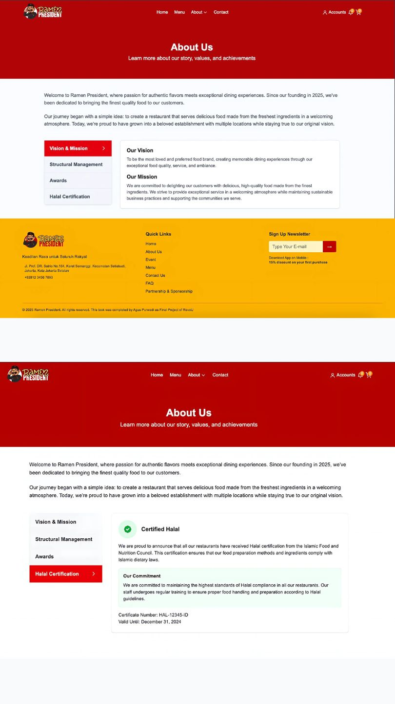
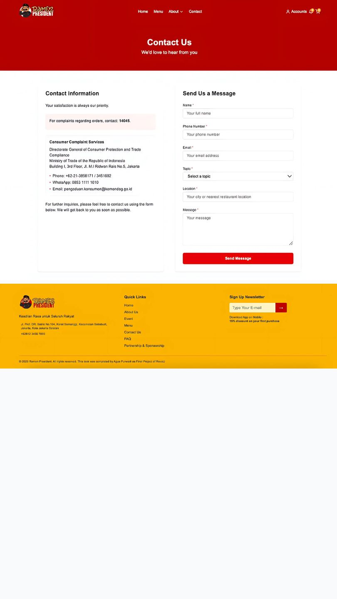

# Ramen President - Restaurant Management System

This is a modern restaurant management system built with Next.js 15.3.4 and React 19. The project provides a complete solution for restaurant operations including menu management, ordering system, and admin dashboard.

## Features

- **Interactive Menu**: Browse and filter menu items by category
- **Product Detail Pages**: View detailed information about each menu item with image gallery
- **Shopping Cart**: Add items to cart with quantity control
- **User Authentication**: Secure login and registration with Next-Auth
- **Admin Dashboard**: Manage products, orders, and customer data
- **Responsive Design**: Optimized for both mobile and desktop experiences
- **PDF Generation**: Create receipts and reports with jsPDF and html2canvas

## Screenshots

### Customer Interface

*Home page with featured menu items and navigation*


*Home page with featured menu items and navigation in dark mode*


*Menu page with filter options and product list*


*Detailed product view with image gallery and ordering options*


*User-friendly shopping cart with quantity controls*


*Checkout page with order summary and payment options*


*Order confirmation page with order details and receipt*


*Thank you page with order confirmation and navigation*


*About us page with restaurant information*


*FAQ page with common questions and answers*


*Contact us page with form for customer inquiries*

### Admin Dashboard

*Comprehensive admin dashboard for restaurant management with customer management features*


*Track and manage customer orders efficiently with manual booking feature*


*Edit product details in the admin dashboard*


*Manage pages and update product, order detail, and manual booking details in the admin dashboard*

## Tech Stack

- **Frontend**: Next.js 15.3.4, React 19, TailwindCSS 4
- **Authentication**: Next-Auth, JWT, bcryptjs
- **State Management**: React Context API, SWR for data fetching
- **Form Handling**: React Hook Form
- **PDF Generation**: jsPDF, html2canvas, react-to-print
- **Development**: TypeScript, Turbopack

## Getting Started

First, run the development server:

```bash
npm run dev
# or
yarn dev
```

Open [http://localhost:3000](http://localhost:3000) with your browser to see the result.

## Project Structure

- `/src/app`: Next.js App Router pages and layouts
- `/src/components`: Reusable UI components
- `/src/context`: React Context providers (Cart, Auth)
- `/src/hooks`: Custom React hooks
- `/src/lib`: Utility libraries and authentication
- `/src/types`: TypeScript type definitions
- `/public/images`: Static images and assets
- `/public/images/documentation`: Documentation images

## Learn More

To learn more about the technologies used in this project:

- [Next.js Documentation](https://nextjs.org/docs)
- [React Documentation](https://react.dev)
- [TailwindCSS Documentation](https://tailwindcss.com/docs)
- [Next-Auth Documentation](https://next-auth.js.org)

## Backend-Frontend Integration

This project requires integration with a backend API for full functionality. The frontend communicates with the backend through RESTful API endpoints.

### API Configuration

The frontend is configured to connect to the backend API using environment variables:

```bash
# .env.local example
NEXTAUTH_URL=http://localhost:3000
NEXTAUTH_SECRET=your-secret-key-change-this-in-production
NEXT_PUBLIC_API_URL=http://localhost:4005
```

### Integration Points

- **Authentication**: User login/registration handled through Next-Auth with JWT tokens
- **Product Management**: Menu items fetched from backend API endpoints
- **Order Processing**: Orders submitted to backend for processing and storage
- **Customer Data**: Customer information managed through secure API endpoints
- **Admin Dashboard**: Admin features communicate with backend for data management

### Update Process

When updating the application, ensure both frontend and backend changes are synchronized:

1. **API Contract**: Maintain consistent API endpoints and payload structures
2. **Version Control**: Tag releases to ensure compatible frontend and backend versions
3. **Environment Variables**: Update environment configurations when API changes occur
4. **Testing**: Test integration points thoroughly after updates to either system
5. **Deployment**: Deploy backend changes before or simultaneously with frontend updates

## Dark Mode
The application supports dark mode with a custom theme. Users can toggle between light and dark modes using the theme switcher in the navigation bar.

## Receipt Generation
Users can generate PDF receipts for their orders. The receipt includes order details, total amount, and payment method.

## Contact Us Form
The contact us form allows customers to send messages directly to the restaurant. Form submissions are handled securely and stored in the database.

## Admin Features
- **Product Management**: Add, edit, and delete menu items
- **Order Management**: View and manage customer orders
- **Customer Management**: View and manage customer information
- **Reporting**: Generate reports on orders and customer activity
- **Manual Booking**: Manage table bookings manually through the admin dashboard
- **User Management**: Manage user accounts and permissions


